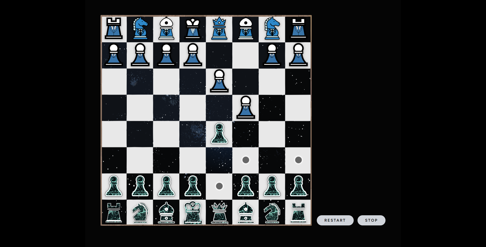
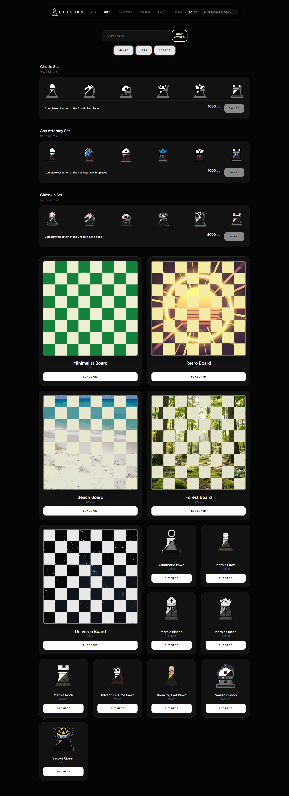
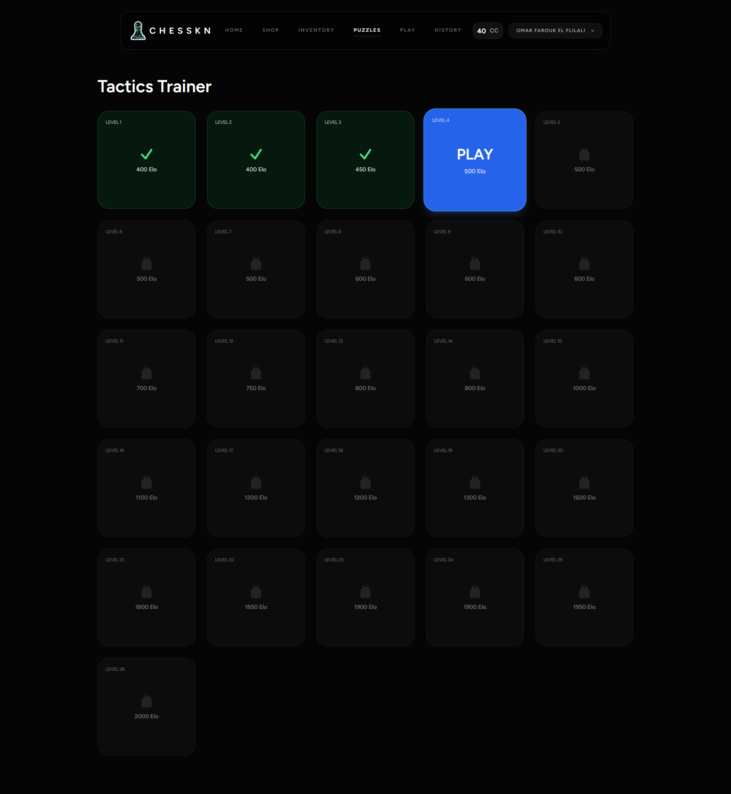
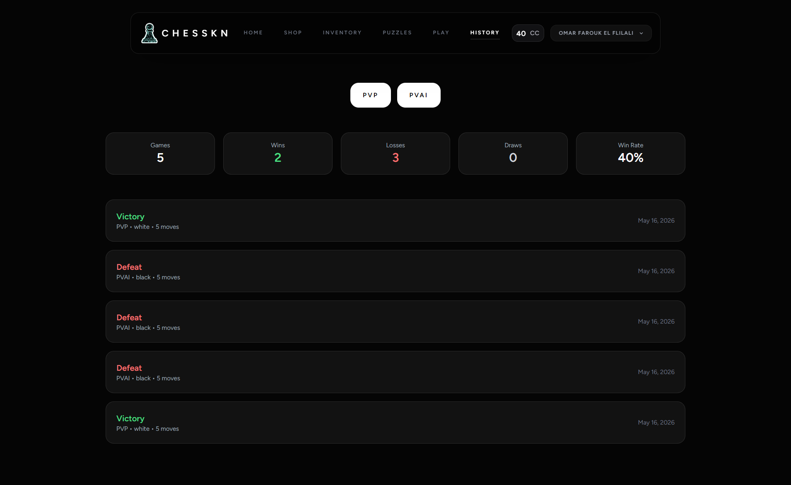

# Chesskin

Welcome to **Chesskin**, a modern, responsive chess platform where you can play locally with a friend or challenge our built-in bot (powered by Stockfish) across different difficulties!

Unlike traditional chess apps, **Chesskin** rewards you for playing. Win matches to earn coins, which you can spend in our store to buy exclusive skins for your chess pieces and boards. You can also hone your skills in our **Puzzles Mode**, featuring real puzzles from actual games, and review your past matches on the **History Page**.

## Tech Stack

This project is built using a modern, robust web stack:
- **Backend Framework**: Laravel 13
- **Frontend**: Vue.js 3 with Inertia.js
- **Styling**: Tailwind CSS
- **Build Tool**: Vite
- **Chess Engine**: Stockfish

## Key Features

### 🎮 Play Locally or vs. Bot
Play locally with friends or challenge the Stockfish bot with adjustable difficulties.
<!-- Replace with actual path to screenshot -->

### 💰 Earn Coins & Buy Skins
Win matches to earn coins and customize your experience with unique piece and board skins.
<!-- Replace with actual path to screenshot -->

### 🧩 Real Game Puzzles
Sharpen your tactics with puzzles sourced from real chess games.
<!-- Replace with actual path to screenshot -->

### 📜 Match History
Review your past games to analyze your performance and track your progress.
<!-- Replace with actual path to screenshot -->

### 📱 Responsive Design
Play seamlessly on any device—desktop, tablet, or mobile.
<!-- Replace with actual path to screenshot -->

---
*Note: The screenshot paths are currently placeholders. Please add your actual screenshots to `public/assets/screenshots/` or update the paths in this README.*
